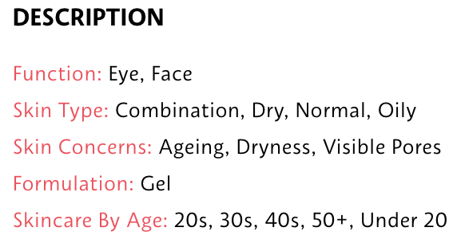

# Capstone Project - Cos Skin  <i style = "font-size:16px">Your skin but better</i>

This project consists of 8 jupyter notebooks. 
- Notebook 1 covers Web Scraping of basic product information
- Notebook 2 covers Web Scraping of more detailed product information
- Notebook 3 covers Pulling product reviews with APIs
- Notebook 4 covers EDA and Data Cleaning
- Notebook 5 covers Pre-processing of the data
- Notebook 6 covers Modeling
- Notebook 7 covers App Deployment to Streamlit & Conclusion

## Background
The number of skincare brands and products in the market are ever increasing. And having more options does not necessarily help us make better choices. The overwhelming number of available options to create a skincare routine from scratch may lead to decision fatigue instead. Hence I decided to build a skincare recommender to help beginners put together a simple skincare routine and to expose existing skincare users to more options as well.  

I will be looking at 5 different categories: Cleanser, Toner, Day Moisturizer, Night Cream, Sunscreen to create a simple skincare routine.

## Goal
To recommend 5 different products based on user's profile and preferences. These 5 products put together gives the user a morning routine consisting of 4 products, and a night routine consisting of 3 products.
| Morning Routine                                                            | Night Routine                                    |
|----------------------------------------------------------------------------|--------------------------------------------------|
| 1. Cleanser   2. Toner  3. Day Moisturizer   4. Sunscreen  | 1. Cleaner   2. Toner  3. Night Cream  |

## Data Collection
For this project, I will be scraping data from Sephora Singapore. To focus on a simple skincare routine, I will be zooming into the 5 basic categories - cleanser, toner, day moisturizer, night cream and sunscreen.

The initial scraping obtains 1466 products in total. As I am looking to recommend only one product for each category, I will drop any items that contain words such as 'set', 'kit', 'trio'. And also drop products for men as they make up a very small percentage of the dataset and no gender filters are available at the moment. I also created a new column to act as a unique identifier for each item as there may be products from different brands but the same name.

In the second notebook, I will also be using Selenium to scrape additional product information which includes product descriptions, product claims, product ingredients and product images.

In the third notebook, I will be pulling user reviews from Sephora using APIs. (Due to time limit, sentiment analysis will be ran at a later stage. The code can be found in WIP folder.)

## Data Cleaning
- The product filter types that will be used for my recommendation system was extracted as a paragraph and sits within the same cell. (As seen in the image below). I used regex to split each filter type into individual columns.   

 
- Manual labeling
    - Impute null filter types by doing online research and tagging accordingly 
- Impute null rating values with the median
- Drop unnecessary products
    - Products for men 
    - Products that come as a set
    - Products that are refills
- After data cleaning, there is a total of 1039 products left. 

## EDA Summary
- Of the 5 categories, Day Moisturizer has the highest number of products (355) and Sunscreen has the lowest (77)
- Product ratings follow a left-skewed distribution, with a mean of around 4 out of 5 stars across categories
- Product prices follow a right-skewed distribution. Cleansers have the lowest average price of \\$56.86, while Day Moisturizer and Night Cream has an average price that's twice that of cleansers at \\$107.86 and \\$118.03 respectively.
- 18.9% of the products have 0 ratings. This could be because the product is newly launched, especially since the datasets were scraped on 9th November, where Christmas selections were probably just launched

## Pre-processing 
- Filter tags are dummified and simple EDA is done to detemine the weights of each filter type. 
- For `Skin Types`, more than 90% of products across all categories have `Combination`, `Dry`, `Normal` and `Oily` tags
- For `Age`, more than 90% of products across all categories have `Combination`, `Dry`, `Normal` and `Oily` tags
- There is more variation in `Skin Concerns` and `Formulation` tags
-  I will assign a lower weight to `Skin Types` and `Age` filter tags and a higher weight to `Skin concerns` and `Formulation` 

## Modeling
I used content-based filtering to generate recommendations for _new users_. Filter tags are used as the basis of my recommendation system. In doing so, I will be able to avoid running into cold-start issues and having to wait for more explicit data from a new user before giving any recommendations.

## App Deployment
https://cos-skin.streamlit.app/

## Conclusion

By inputting your basic user information (skin type and user's age) and skincare preferences (skin concerns and formulation), the recommender is able to recommend a list of products that form a simple 4-step skincare routine. This recommender will aid new users with decision fatigue and serve as a stepping stone for them to start a skincare routine. For skincare enthusiasts, this recommender can aid in recommending alternative products to broaden their choices (if needed).

## Limitations
- As the data collected is from Sephora's website, the tags are dependent on the company as well. It is likely that they will tag products with as many filter tags as possible to increase appearance of the products when customers use filter options. Hence accuracy of filters tagged cannot be assured.
- User reviews and ratings include those from Sephora US as well. Since Sephora US has a larger and more active customer base, the ratings maybe influenced by US customers. Due to the difference in climate and environments, as well as skin types, the user ratings may not be 100% applicable to customers in Singapore. 

## Future Works
- Add more skincare categories (Mask, Serum, Eye cream etc)
    - Allow users to determine the categories they want recommendations for to create their own skincare routine
- On top of filter tags by Sephora, look into product ingredients to determine the use and effective of products
- Add in User-based recommendation with implicit data and reviews of all attractions